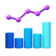

<div id="header" align="center">
  <a href="https://linktr.ee/ChiaraMancarella">
    
  </a>
</div>

### I am...

```text
an engineering student with a passion for solving problems and understanding how things work.
When I’m not studying, I enjoy programming and bringing ideas to life through 3D printing
and creative projects.

Whether it’s designing something from scratch or improving an existing solution, I love exploring
the intersection of technology and creativity. 🌟
```

<br><br>


#  Languages and Tools
<div>
  &nbsp;
  &nbsp;
  &nbsp;
  &nbsp;
  &nbsp;
  &nbsp;
  &nbsp;
  &nbsp;
  &nbsp;
  &nbsp;
  &nbsp;
  &nbsp;
  &nbsp;
  &nbsp;
  &nbsp;
  &nbsp;
  &nbsp;
  &nbsp;
  &nbsp;
</div>
<br>


#  OS
<div>
  
  
  
</div>
<br>

#  Prototyping Platforms
<div>
  
  
  
</div>
<br>

#  Stats


